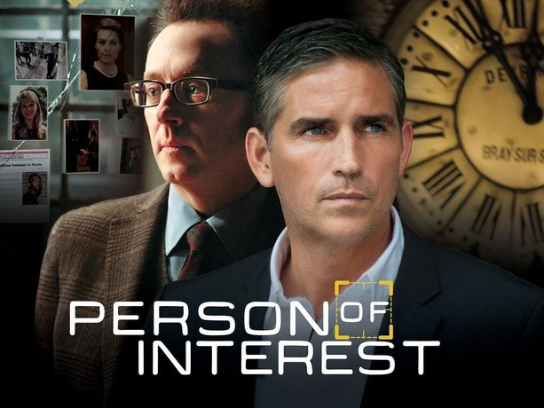
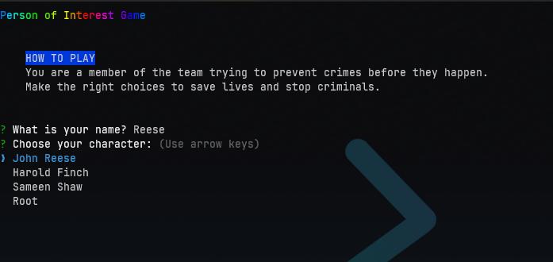

# Person of Interest Game



Step into the high-stakes world of the hit TV series *Person of Interest*. In this immersive game, you'll join a secret team dedicated to preventing crimes before they happen. Make critical decisions, complete challenging missions, and become the hero that saves the day. Are you ready to take on the challenge?

## Table of Contents
- [Introduction](#introduction)
- [Features](#features)
- [Installation](#installation)
- [Usage](#usage)
- [Contributing](#contributing)
- [License](#license)

## Introduction

Welcome to the **Person of Interest Game**! Inspired by the acclaimed TV series, this game puts you in the shoes of key characters like John Reese, Harold Finch, Sameen Shaw, and Root. Each decision you make will influence the outcome of your missions, where success or failure is determined by your choices.

## Features

- **Character Selection**: Choose to play as John Reese, Harold Finch, Sameen Shaw, or Root.
- **Multiple Missions**: Engage in a variety of missions, each with branching paths and different outcomes based on your choices.
- **Immersive Storyline**: Experience detailed scenarios that bring the intensity of the TV series to your command line.
- **Real-time Decisions**: Make quick, strategic decisions to thwart potential threats and save lives.

## Installation

To set up the game, follow these steps:

1. **Clone the Repository**:
   ```bash
   git clone https://github.com/THEODDYSYEY/person-of-interest-game.git
   cd Quiz-CLI-Game
   ```

2. **Install Dependencies**:
   ```bash
   npm install
   ```

## Usage

Start the game by running the following command:

```bash
 node index.js
```

Follow the on-screen prompts to dive into your first mission. Make your choices wisely to succeed.

## Contributing

We welcome contributions from the community! If you'd like to add new features, fix bugs, or improve the game, feel free to open a pull request or submit an issue.

## License

This project is licensed under the MIT License. See the [LICENSE](LICENSE) file for more details.

---

## Preview

Here's a sneak peek at the game in action:



---

Dive into the world of *Person of Interest* and become the hero the city needs. Your mission starts now!

---
